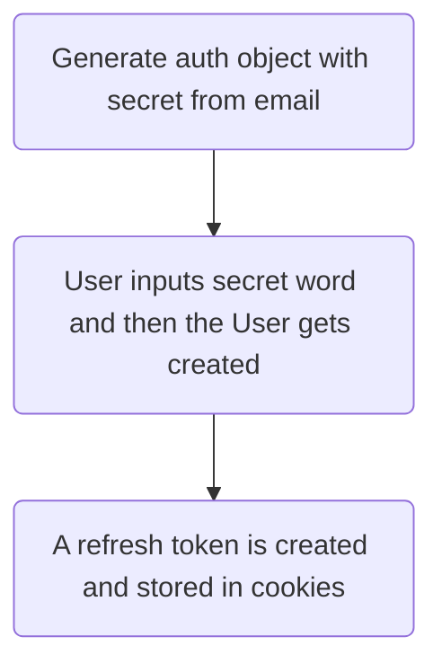

# GraphQL Auth

This a backend authentication and authorization system built in node.js using [TypeORM](https://typeorm.io/#/), [TypeGraphQL](https://typegraphql.ml/), and jsonwebtokens.

It's a semi passwordless system, in the sense that the app doesn't store any passwords in the user database. Instead it generates a random word to validate each new session. The refresh token is stored in cookies and validates the accessToken which is the token that gives permissions.

## User auth flow

## Use it with your favorite framework
React/NextJS (WIP)